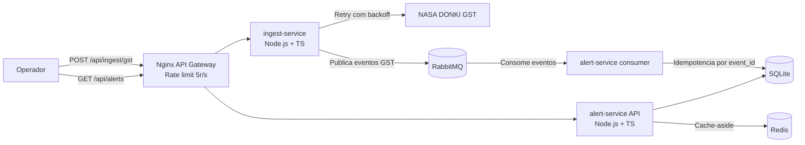

## Integrantes do grupo

| Nome | RM |
|------|----|
| Diogo Witzel | RM552754 |
| Lucas Domingues | RM553304 |
| Victor Morelli | RM553338 |

---

# Solar Shield - Sistema de Monitoramento de Clima Espacial

Sistema de microsserviços que ingere dados reais da NASA DONKI, classifica riscos de tempestades geomagnéticas e disponibiliza alertas para operadores de infraestrutura crítica.

## Arquitetura



## Regras de negocio

- RN1: `Kp <= 4` gera severidade `low`; `5 <= Kp <= 7` gera `moderate`; `Kp >= 8` gera `severe`.
- RN1: quando a severidade for `severe`, `emergencyNotification = true`.
- RN3: eventos com o mesmo `event_id` sao descartados no `alert-service`; duplicatas geram log `[idempotency] duplicate event discarded`.

## Cache Redis

O endpoint `GET /api/alerts` usa cache-aside em Redis na chave `alerts:list`.

TTL justificado: TTL de 60s reduz leituras repetidas em consultas operacionais sem ocultar alertas por muito tempo; o cache tambem e invalidado quando novo alerta e persistido.

## Como executar

Requisitos:

- Docker e Docker Compose.
- Opcional: chave NASA em `NASA_API_KEY`. Sem ela, o sistema usa `DEMO_KEY`.

Suba todo o ambiente:

```bash
docker-compose up --build
```

Servicos expostos:

- API Gateway: `http://localhost:8080`
- RabbitMQ Management: `http://localhost:15672` (`guest` / `guest`)

## Roteiro de avaliacao

Disparar ingestao da NASA:

```bash
curl -X POST http://localhost:8080/api/ingest/gst `
  -H "Content-Type: application/json" `
  -d "{\"startDate\":\"2024-05-01\",\"endDate\":\"2024-05-31\"}"
```

Consultar alertas:

```bash
curl http://localhost:8080/api/alerts
```

A resposta possui o campo `cache` com `hit` ou `miss`. Os logs do `alert-service` tambem registram cache hit/miss, invalidacao de cache e descarte de duplicatas.

Verificar RabbitMQ:

- Acesse `http://localhost:15672`.
- Entre com `guest` / `guest`.
- Confira a fila `space-weather.gst`.

Verificar rate limiting:

```bash
for /L %i in (1,1,30) do curl -s -o nul -w "%{http_code}\n" http://localhost:8080/api/alerts
```

Em PowerShell:

```powershell
1..30 | ForEach-Object { curl.exe -s -o NUL -w "%{http_code}`n" http://localhost:8080/api/alerts }
```

## Testes unitarios

Instale dependencias localmente:

```bash
npm install
```

Rode os testes:

```bash
npm test
```

Os testes cobrem:

- RN1 com Kp `4` => `low`.
- RN1 com Kp `6` => `moderate`.
- RN1/RN3 com Kp `8` => `severe`, `emergencyNotification = true` e descarte de duplicata por `event_id`.

## Smoke test k6

Com o Docker Compose rodando:

```bash
docker compose run --rm k6
```

Configuracao: `10 VUs / 10s`.

Para salvar o resultado exigido na pasta `/k6`:

```bash
docker compose run --rm k6 > k6/result.txt
```

Se preferir rodar com k6 instalado localmente:

```bash
k6 run -e BASE_URL=http://localhost:8080 k6/smoke.js
```

## Endpoints

- `GET /health`: healthcheck do gateway.
- `POST /api/ingest/gst`: busca eventos GST na NASA DONKI e publica no RabbitMQ.
- `GET /api/alerts`: lista alertas classificados com cache Redis.

## Variaveis de ambiente

- `NASA_API_KEY`: chave NASA, padrao `DEMO_KEY`.
- `RABBITMQ_URL`: URL RabbitMQ.
- `GST_QUEUE`: fila de eventos, padrao `space-weather.gst`.
- `REDIS_URL`: URL Redis.
- `ALERTS_CACHE_TTL_SECONDS`: TTL do cache de alertas, padrao `60`.
- `DB_PATH`: caminho do SQLite no `alert-service`.


